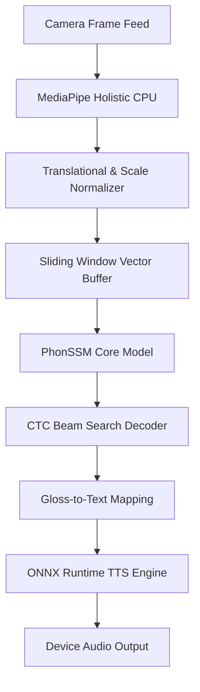

# Architectural Specification — ManoSpeak

## 1. High-Level Inference Pipeline
ManoSpeak operates as a zero-latency, local execution pipeline divided into four main layers:

## 2. Component Breakdown

### Perception: MediaPipe Holistic
To avoid the CPU/GPU memory footprint of processing high-resolution RGB video frames directly, ManoSpeak uses Google's **MediaPipe Holistic** pipeline to extract geometric coordinate vectors:
- **BlazePose:** Locates global body alignment and isolates regions of interest (ROI) for the face and hands.
- **Keypoint Tracking:** Tracks 543 distinct landmark points in 3D:
  - 33 Pose landmarks (body outline)
  - 42 Hand landmarks (21 per hand)
  - 468 Face landmarks (micro-expressions and gaze)
- This processing runs at 30+ FPS directly on the mobile CPU, collapsing multi-megabyte video frames into dense, light-weight 1D coordinate vectors.

### Sequence Analysis: Online CSLR via Sliding Windows
Unlike Isolated Sign Recognition (ISLR), which requires pauses between signs, ManoSpeak implements **Online Continuous Sign Language Recognition (CSLR)**:
- **Sliding Window:** A fixed temporal window crawls over the live coordinates stream.
- **CTC (Connectionist Temporal Classification):** Calculates the emission probabilities of words (glosas) plus a special blank token representing transitions and coarticulation.
- A Beam Search Decoder collapses duplicate adjacent predictions and strips blank tokens to reconstruct the sentence structure incrementally.

### Generalization: Phonological State Space Model (PhonSSM)
To scale to massive vocabularies without training individual classifier models for every word:
- **Anatomical Graph Attention (AGAN):** Focuses attention on structural joint connections.
- **Ortogonal Factoring:** PhonSSM decodes the hand shape, the location relative to the torso, and the motion vector into separate, orthogonal embeddings.
- **Zero-Shot Recognition:** A new word is decoded simply by identifying its components (e.g., *flat hand + forehead + circular motion*) and checking the INSOR LSC dictionary recipes, enabling vocabulary extension without re-training.

### Speech Synthesis: On-Device ONNX/TTS
- **Local Engine:** TTS is handled offline using **ONNX Runtime Mobile** (compiled via `react-native-executorch` for Kokoro/Supertonic voices).
- **Fallback:** Delegates directly to native operating system engines (`android.speech.tts.TextToSpeech` and `AVSpeechSynthesizer`) if ONNX Runtime is uninitialized or resources are constrained.
