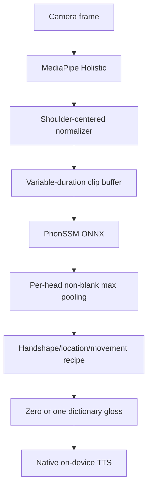
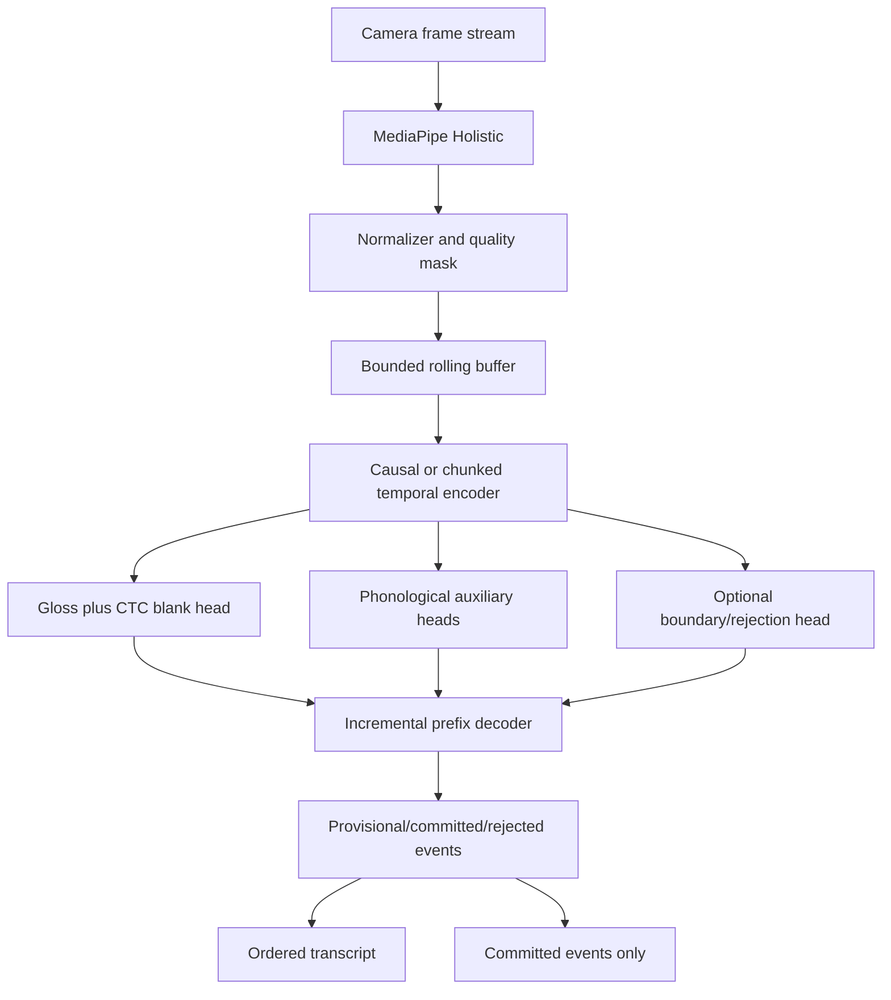

# Architectural Specification: ManoSpeak

## 1. Status

ManoSpeak is transitioning from variable-duration isolated sign recognition to a
constrained continuous recognition pilot. The current model is not release-ready CSLR:

- Training assigns exactly one phonological target triple to each clip.
- The temporal backbone is a bidirectional GRU.
- Mobile inference max-pools each phonological head across a complete window.
- The mobile decoder returns at most one gloss per window.

The target architecture below is gated by `RECOGNITION_CONTRACT.md` and
`EVALUATION_PROTOCOL.md`. Planned components are not current capabilities.

## 2. Current Pipeline

### Landmark Perception

- Landmark order is 33 pose, 21 left hand, 21 right hand, and 468 face points.
- Missing groups are represented by zero coordinates.
- Mobile and ML normalize around the shoulder midpoint and shoulder scale.
- Camera orientation, mirroring, extraction version, timestamps, and effective FPS must
  be preserved in future sample manifests.

### Current PhonSSM

- A global anatomical-attention trunk processes all 543 landmarks.
- A hand-specific branch processes landmarks 33-74.
- Per-frame heads emit handshape (64 classes), location (32), and movement (32).
- CTC blank indices are 63 for handshape and 31 for location/movement.
- CTC is currently trained with target length one. Per-frame output alone does not make
  the model continuous.

### Current Decoder Limitation

The mobile service independently selects the strongest non-blank handshape, location,
and movement over the full input. This destroys temporal order and composes one recipe.
It cannot emit `HOLA -> TU` from one uninterrupted stream.

## 3. Target Continuous Pipeline

### Required Changes

1. Train a primary gloss-vocabulary CTC head with true multi-gloss targets.
2. Retain phonological heads only as auxiliary losses unless ablation proves another
   sequence-preserving use.
3. Replace the bidirectional dependency with a causal or bounded-lookahead encoder.
4. Train on real coarticulated sequences and non-sign/unknown regions.
5. Decode incrementally using blank probability, prefix stability, confidence,
   repetition evidence, and optional boundaries.
6. Commit ordered events without requiring hand lowering or a neutral pose.

## 4. Data Domains

- LSC70 contains 3,284 six-image transitions from 70 non-expert volunteers. It has no
  physical FPS metadata in the unified tensors.
- LSC50 contains 1,000 variable-length sequences from five signers and 20
  signer/repetition sessions.
- These sources are evaluated separately and split by signer before augmentation.
- The current seed-42 random split leaks every signer and is retained only as a frozen
  reproducibility baseline.

## 5. Vocabulary Strategy

Phonological decomposition is useful supervision but does not prove zero-shot lexical
recognition. A new gloss is enabled only after linguistic labeling, positive examples,
confusers, real incoming/outgoing transitions, and signer-disjoint evaluation.

The constrained continuous pilot starts with HOLA, TU, YO, GRACIAS, and ADIOS. The
system learns reusable glosses and transitions rather than every possible sentence.
Spanish sentence generation and LSC grammar modeling are separate later components.

## 6. Speech and Privacy

- Recognition ONNX and native operating-system TTS run locally.
- TTS receives committed event IDs only and speaks each event at most once.
- Raw camera frames remain in volatile processing memory and are not persisted by
  default.
- Diagnostic/personalization landmark retention requires explicit mode, local storage,
  deletion, and consent controls.
